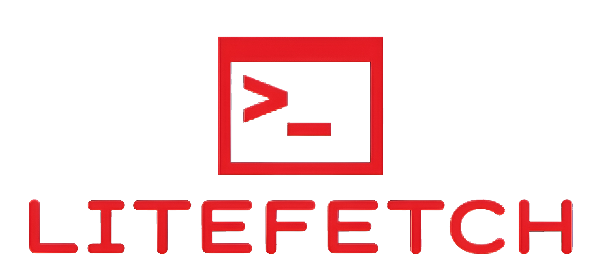

# LiteFetch

LiteFetch is an ultralight fetch program for the space-concious Linux user.


## Installation

1. Go to the releases page and download both art.txt and fetch
2. In the directory where you downloaded the two files, run
```bash
sudo mv art.txt \bin\art.txt
sudo mv fetch \bin\fetch
```

## Usage

```bash
fetch [path to art]
```
If following the installation instructions above, [path to art] is \bin\art.txt

If you want it to run on each new shell instance, put the following line at the bottom of .bashrc or .zshrc
```bash
fetch [path to art]
```

## Contributing

Pull requests are welcome. For major changes, please open an issue first
to discuss what you would like to change.

Please make sure to update tests as appropriate.
